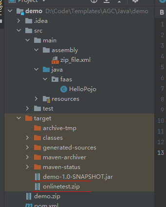

# Java运行环境云函数

## 1. zip包内容结构
    function.zip
        |---config
            |---配置项
        |---lib
            |---依赖项 *.jar
            |---处理程序编译后的jar

## 2. 安装依赖方式
1. java语言项目可通过maven相关命令管理所需依赖。
2. zip_file.xml文件、pom.xml文件已编写好生成zip的脚本，项目进行编译后可通过mvn package命令自动将项目打包为上述结构。
生成的zip包放置在编译过后生成的target文件下。
