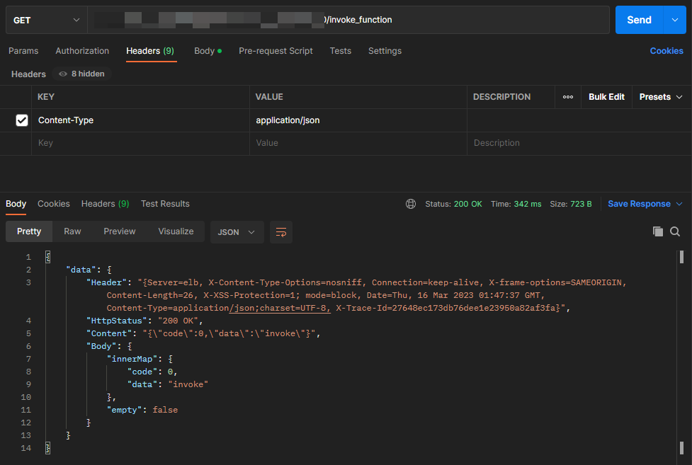

## 云端调用云函数示例 快速入门

## 介绍
本项目帮助您在云端调用云函数。云端调用指在云函数的java-runtime或custom-runtime运行环境使用SDK调用云函数接口。

## 环境准备
您的服务器需要支持Java8或者更高版本

## 快速开始
1. 创建一个函数名为"called"，函数类型为"http请求"的云函数。（参考"custom-runtime-function-demo"项目）
2. 下载并更新/resources目录下的认证凭据文件"agc-apiclient-key.json"。
3. 在com.huawei.faas.service 43行填入被调函数的函数名称和版本.
4. 在com.huawei.faas.service 61行填入自定义HttpMethod、自定义url、自定义headers和自定义requestBody.
5. 执行maven构建命令打包本项目.
6. 创建函数名为"invoke-http-function-on-cloud"的http请求类型云函数，并上传第5步构建的xxx.zip项目包.
7. 调用"invoke-http-function-on-cloud"云函数.

## 构建帮助
1. Java 语言项目可通过maven相关命令管理所需依赖。
2. zip_file.xml文件、pom.xml文件已编写好生成zip的脚本。
3. 项目可通过mvn package命令进行编译，自动将项目打包为上述结构。
4. 生成的zip包放置在编译过后生成的/target目录下。

## 示例

