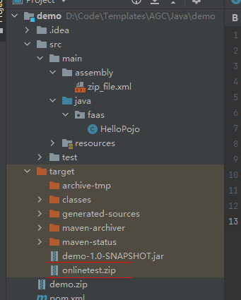

# Java-runtime cloud function

## Introduction
Java-runtime cloud function help you quickly build your cloud function(java-runtime).

## Preparing the Environment
Before using the sdk, your server need support Java 8 or higher.

## 1. zip file structure
    function.zip
        |---config
            |---config
        |---lib
            |--- *.jar (Dependencies/Compiled jar)

## 2. Build Help
1. Java language projects can be managed by using Maven commands.
2. Scripts for generating ZIP files have been compiled in the zip_file.xml and pom.xml files.
3. After the project is compiled, you can run the mvn package command to automatically package the project into the preceding structure.
4. The generated xx.zip package is stored in the /target directory generated after compilation.

