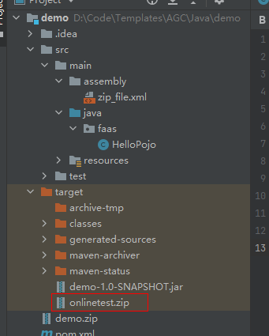

# Java-runtime-function-demo项目

## 介绍
本项目帮助您快速构建云函数(java-runtime).

## 环境准备
您的服务器需要支持Java8或者更高版本

## 1. Zip包内容结构
    function.zip
        |---config
            |---config
        |---lib
            |--- *.jar (Dependencies/Compiled jar)

## 2. 构建帮助
1. Java 语言项目可通过maven相关命令管理所需依赖。
2. zip_file.xml文件、pom.xml文件已编写好生成zip的脚本。
3. 项目可通过mvn package命令进行编译，自动将项目打包为上述结构。
4. 生成的zip包放置在编译过后生成的/target目录下。

